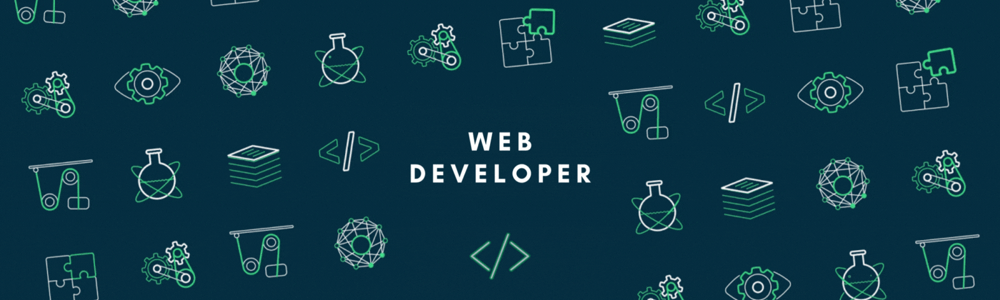
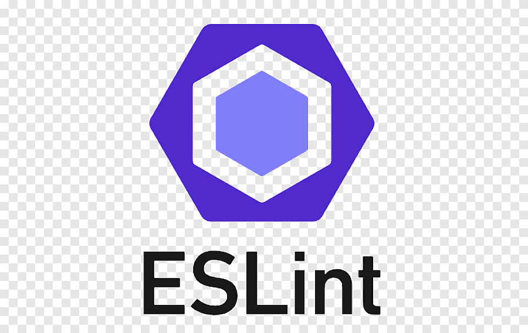
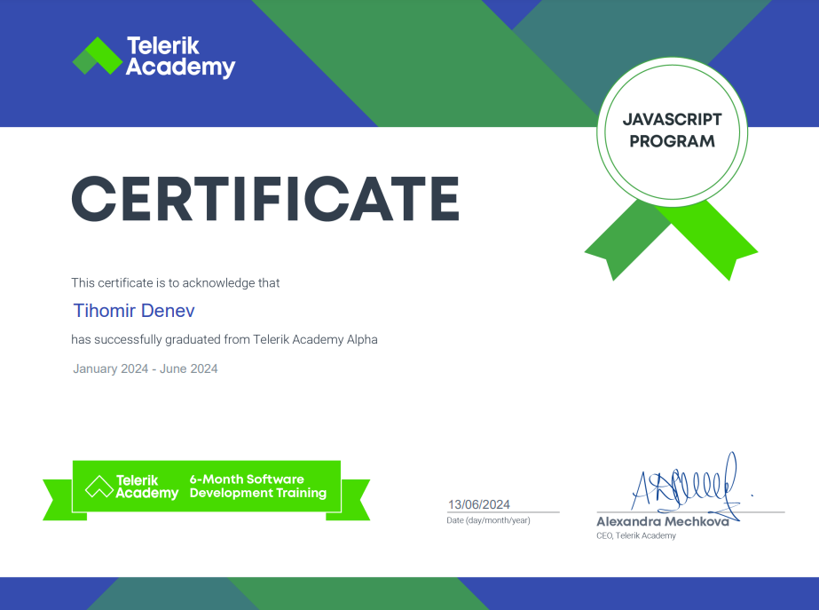

<h1 align="center">Hi 👋, I'm Tihomir Denev</h1>

<h3 align="center">
  I'm a passionate 27-year-old front-end developer from Sofia, Bulgaria, with a strong focus on JavaScript and React. I graduated from the Alpha JS program at Telerik Academy. Driven by a thirst for knowledge and a love for problem-solving, I constantly push myself to master new technologies and tackle challenges head-on. Currently, I am working in a company where I study and use Angular, TypeScript, and other related technologies.
</h3>

<h3 align="left" >🤝 Connect with me:</h3>

<h3 align="left">🌱Education:</h3>

- Telerik Academy: Completed Alpha JavaScript Track.

- Technical University of Sofia: Bachelor of Automatic.

- Science and Mathematics High School: Informatics.
  
<h2 align="left">🛠️ Technical Proficiency:</h2>
Proficient in JavaScript, HTML, CSS, React, and Firebase. Currently expanding my skills in TypeScript and server-side technologies.

<h2 align="left">💻 Languages and Tools:</h2>

###

<h2 align="left">🎓 My certificate</h2>

###

<h2>💥 My Life Philosophy:</h2>
 
###

Approach every task with a positive attitude and a smile, striving to improve and excel each time.😉
 
  

  

