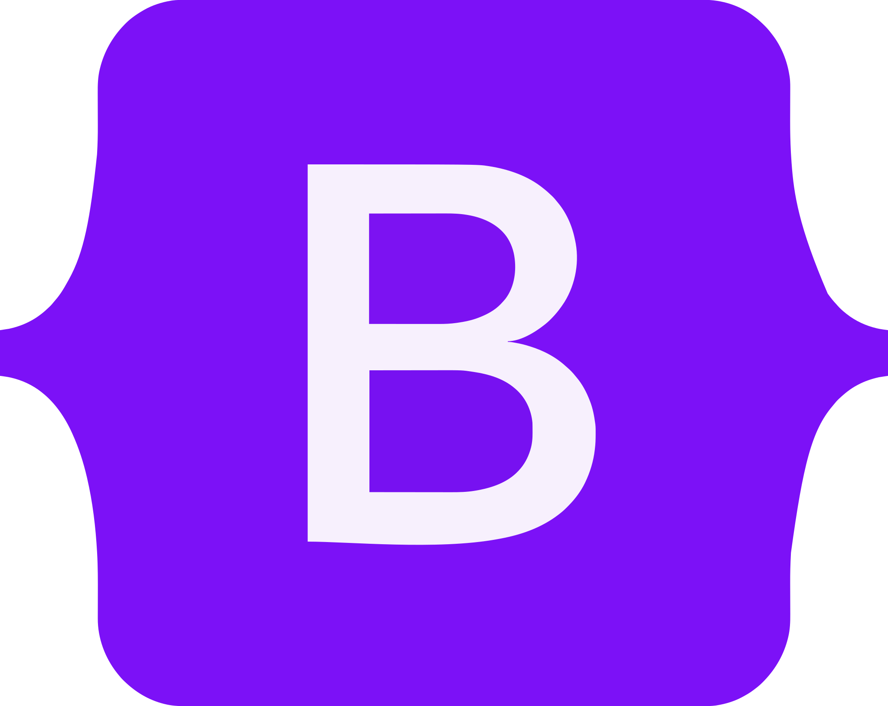
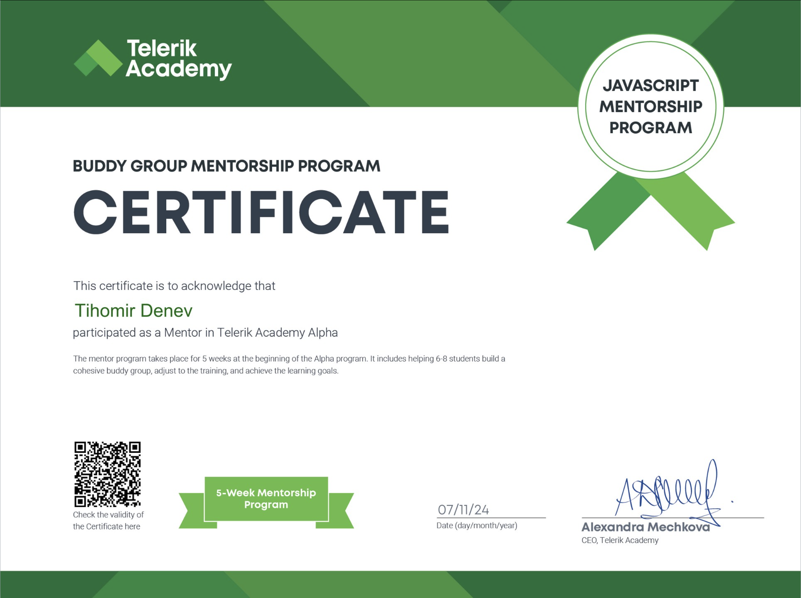

<h1 align="center">Hi 👋, I'm Tihomir Denev</h1>

<h3 align="center">
  I'm a passionate front-end developer from Sofia, Bulgaria, with a strong focus on modern JavaScript frameworks and a love for building engaging user experiences. I graduated from the Alpha JS program at Telerik Academy and hold a Bachelor’s degree from the Technical University of Sofia. My journey has taken me from React and JavaScript to mastering Angular, TypeScript, and a wide range of tools and technologies. I thrive on learning, problem-solving, and collaborating to deliver high-quality software.
</h3>

<h3 align="left" >🤝 Connect with me:</h3>

<h3 align="left">🌱 Education:</h3>

- Telerik Academy: Completed Alpha JavaScript Track
- Technical University of Sofia: Bachelor of Automation
- Science and Mathematics High School: Informatics

 

<h2 align="left">🛠️ Technical Proficiency:</h2>
Proficient in JavaScript, TypeScript, Angular, and React, with hands-on experience in building scalable front-end applications. Experienced with state management, component-driven development, and modern UI frameworks. Expanding my full-stack skills with Node.js, Firebase, and cloud technologies.

<h2 align="left">💻 Languages, Frameworks & Tools:</h2>

<h2 align="left">🚀 Featured Projects</h2>

- Explore my portfolio for a showcase of my work: [My Portfolio](https://my-portfolio-tihomirdenevs-projects.vercel.app/)

<h2 align="left">🎓 Certifications</h2>

  
  
  
   
  
  
  

<h2>💥 My Life Philosophy:</h2>

Approach every task with a positive attitude and a smile, striving to improve and excel each time. 😉

  
  

  

